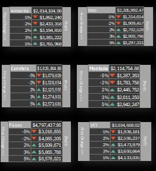
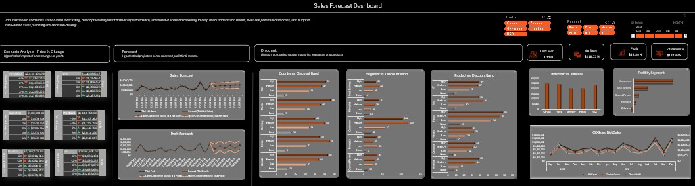

# Sales Forecast Excel Project
## Project Overview

**Project Title**: Sales Forecast  
**Platform Used**: Microsoft Excel  
**Data Source**: Udemy "Build 45 Real-World Power BI Projects for BI & Data Analysts" Course.    
**Analytics Approach**: Descriptive, Scenario-Based (What-if) & Predictive Analytics (Forecast Sheet).

This Excel project integrates descriptive analytics, scenario‑based modeling, and predictive forecasting to provide a complete view of business performance. It summarizes historical trends, simulates the impact of price changes through What‑If analysis, and projects future outcomes using Excel‑based forecasting models.

## Core Skills Applied  

1. Data cleaning.
2. Pivot tables and charts.
3. Interactive slicers.
4. Data Visualization & Dashboard Design.

## Project Structure

### 1. Data Import  
- Connected to the original data source and loaded the financials table into Power Query for transformation.

### 2. Data Cleaning
I applied several pre‑processing steps to ensure data accuracy and consistency, including:  
- Renaming and standardizing column names.
- Applying correct data types (e.g., Date, Text, Whole Number, Decimal Number) to support proper aggregation, calculations, and sorting.
- Removing irrelevant or bad records (such as blank columns, invalid entries, errors, and unhelpful data).
- Adding custom transformation columns (such as Month Number, Month Name, and Year) to enable easier grouping, filtering, PivotTable analysis, and forecasting.
- Replacing inconsistent values by correcting variations in product names, fixing formatting issues, and standardizing country and date formats.
- Validating the dataset using the Column Quality and Column Profile features across all 700 rows.

### 3. Pivot Tables & Charts
After cleaning the dataset, I created multiple Excel PivotTables to summarize and analyze performance metrics such as:  
- Total Net Sales
- Total Profit
- Total Revenue
- Units Sold
- Country vs. Discount Band
- Segment vs. Discount Band
- Product vs. Discount Band
- Profit by Segment
- Units Sold by Country
- Cost of Goods Sold (COGS) vs Net Sales Over Time

This structured pivot model ensured reliable, dynamic reporting throughout the dashboard and the pivot tables served as the data source for the KPI cards, line, bar and column charts.

### 4. Interactive Timeline & Slicers
To enhance user interactivity, I added a Timeline and slicers for:  
- Timeline: Month & Year
- Product
- Country

These slicers allow users to filter all connected pivot tables and visuals at once, enabling quick insights and ad‑hoc exploration.

### 5. Data Visualization & Dashboard Design

#### a. Descriptive Analysis    
**i. Card Visuals:** Designed card visuals to highlight key metrics, including Total Net Sales, Total Profit, Profit Margin, and Units Sold.   

- Total Net sales was $118.73 M.
- Profit totaled $16.89 M.
- Total units sold over the period reached about 1.13M.
- Total revenue stood at approximately $127.93 M.

**ii. Column Chart:** Used a Column Chart to showcase the number of units sold per country.  

- Canada recorded the highest number of units sold, totaling 247,429.
- France followed closely with 240,931 units sold.
- The United States ranked next with 232,628 units.
- Mexico recorded 203,325 units sold.
- Germany had the lowest sales volume at 201,494 units.

**iii. Bar Chart:** Used a Bar Chart to compare profit amounts across segments.  

- The Government segment recorded the highest profit at $11,388,173.
- This was followed by Small Business, with a profit of $4,143,169.
- Channel Partners generated $1,316,803 in profit.
- The Midmarket segment recorded a profit of $660,103.
- In contrast, the Enterprise segment incurred a loss of $614,546.

**iv. Line Chart:** Used a line chart to compare COGs and Net Sales over time.  

- In 2013, net sales totaled $26.42 million, with COGS of $22.54 million, resulting in a gross profit of $3.88 million. The strongest performance occurred in October, which recorded $9.30 million in sales and $1.66 million in Profit.
- In 2014, net sales increased significantly to $92.31 million, while COGS amounted to $79.30 million, generating a gross profit of $13.02 million. Sales peaked in October ($12.38 million) and December ($12.00 million). Notably, December also delivered the best gross profit, at approximately $2.03 million.

**v. Bar Chart (Discounts):** Used bar charts to compare discount bands used across Countries, Products and Segments.  

- **Country vs. Discount Band:** Government dominates discount volume overall, with the highest counts in Medium (119) and High (104) discount bands. Channel Partners lean toward High (35) and Medium (30) discounts. Enterprise shows a strong Low discount pattern (36), with fewer “None” cases (6). Midmarket is balanced, but High discounts (41) are the most common. Small Business has the smallest number of “None” discounts (4), with spending concentrated in Medium (40) and High (32) bands.
- **Segment vs. Discount Band:** Government dominates discount volume overall, with the highest counts in Medium (119) and High (104) discount bands. Channel Partners lean toward High (35) and Medium (30) discounts. Enterprise shows a strong Low discount pattern (36), with fewer “None” cases (6). Midmarket is balanced, but High discounts (41) are the most common. Small Business has the smallest number of “None” discounts (4), with spending concentrated in Medium (40) and High (32) bands.
- **Product vs. Discount Band:** Paseo stands out with 202 transactions, significantly more than other products, and the highest counts in Low (54), Medium (65), and High (68) discount bands. Amarilla, Velo, and VTT show similar discount patterns, dominated by Medium and High discounts. Carretera and Montana display a more balanced distribution, with fewer “None” discounts but strong activity in Medium and High categories. No‑discount cases are consistently low across all products (6–15), confirming that most sales involve some level of discount.

#### b. Excel-based Forecast (Forecast Sheet)

**i. Line Chart (Sales Forecast):** Used a line Chart to provide a hypothetical sales forecast across 6 months.  

- The model projects stable growth into mid‑2015, with monthly sales hovering around $9.5M–$10.5M under the baseline scenario.
- Seasonal highs (like October/December) are visible in the history and implicitly influence the rising baseline.

**ii. Line Chart (Profit Forecast):** Used a line Chart to provide a hypothetical profit forecast across 6 months.  

- The model anticipates moderate profit growth, with alternating rises and dips that mirror past seasonal patterns.
- The forecast range (roughly ±$600K to ±$700K around each point) captures normal historical fluctuations.
- Dec‑2014’s unusually high profit influences the upward forecast trend into early 2015.

#### c. Scenario Analysis (One-Variable Data Table)    

**i. Setup**
- **Base inputs:** Avg Price per product and current Profit.
- **Scenario driver:** Price Change (%) applied to each product individually.
- **Scenarios tested:** −5%, −2%, +2%, +3%, +5%.
- **Output:** Profit at each price change level (one‑variable Data Table).

**ii. Insights** 
- Profit rises monotonically with price across all products; cuts materially reduce profit.
- Most price‑sensitive: Velo and Carretera (~±41–43% swing across −5%…+5%).
- Paseo shows the largest profit swing ($3.6M range).
- A +2% price lift adds roughly +15–17% profit across products (Amarilla +13.5%, Carretera +16.4%, Montana +15.7%, Paseo +14.9%, Velo +17.2%, VTT +14.5%).
- With same demand, +2% to +3% price increases appear high‑leverage, while even small price cuts reduces profit.

#### d. Dashboard  

### 6. Recommendations  

**i. Customer‑Focused Recommendations**
- **Optimize Discounts for Customer Segments:** Customers in the Government, Small Business, and Channel Partner segments frequently receive Medium/High discounts. Review discount justification and tailor offers based on actual value, not habit. Reduce unnecessary discounting for Enterprise customers where profit is negative. Provide value‑added services instead of price reductions.
- **Leverage Seasonal Demand:** Since customers purchase significantly more in October and December, ramp up customer engagement through early seasonal campaigns, loyalty rewards, and bundles.
- **Target High‑Value Countries:** Customers in Canada, France, and the USA have high units sold. Expand marketing investment here to deepen retention and grow share. For lower‑volume regions like Germany, explore product preferences or pricing barriers through customer surveys or targeted research.

**ii. Business‑Focused Recommendations**  
- **Improve Pricing Strategy for Higher Profitability:** A +2% to +3% price increase yields meaningful profit gains across all products, with limited downside. Avoid price cuts unless strategically necessary because profit declines sharply even at −2%.
- **Shift Resources Toward High‑Performing Products:** Paseo delivers the highest profit lift and largest customer base. Increase production, inventory, and promotional support to maximize returns.
- **Rationalize Discount Policies:** Discount bands are highly skewed toward Medium/High in most segments and countries. Establish discount thresholds. Ensure large discounts are tied to volume commitments or strategic deals.
- **Investigate Segment Performance:** The Enterprise segment shows a net loss despite substantial sales volume. Review contract terms, cost structure, and discount policies to enhance performance.

