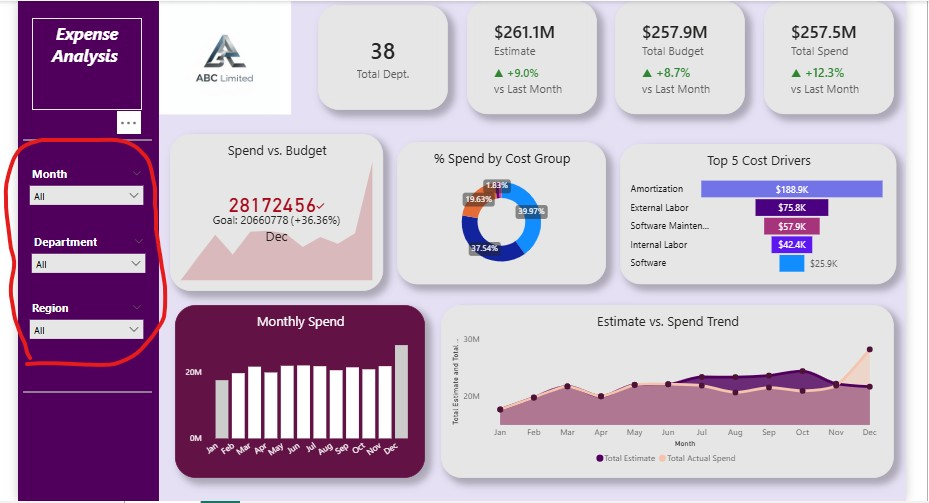

# Expense Analysis PowerBI Project
## Project Overview

**Project Title**: Expense Management Analysis  
**Platform Used**: Microsoft Power BI  
**Data Source**: Udemy "Build 45 Real-World Power BI Projects for BI & Data Analysts" Course.  
**Analytics Approach**: Descriptive, focusing on summarizing and reporting on past data.

This Power BI project showcases a real-world descriptive finance reporting scenario by creating an integrated dashboard that summarizes historical financial performance and spending patterns. It focuses on reporting and visualizing budgets, actual expenditures, and forecasts to highlight trends, variances, and key cost drivers.

## Core Skills Applied

1. Data Cleaning.
2. Data Modeling (galaxy).
3. DAX Formulars.
4. Measures creation.
5. Interactive Filters & Slicers.
6. Data Visualization & Dashboard Design.
7. Trend Analysis.

## Problem Statement

ABC Limited (hypothetical) lacks a unified system for analyzing historical IT departmental expenses across regions, making it difficult to clearly visualize spending patterns, identify major cost drivers, and understand trends in relation to approved budgets and estimates.

## Project Structure

### 1. Data Import
- The Budget and Forecast fact tables were imported into Power BI using the Text/CSV connector.
- The Actuals fact table was loaded using the Folder connector.
- All dimension tables were imported using the Excel connector.

### 2. Data Cleaning
Since my dataset was not clean, I applied several preprocessing steps, including:
- Setting the first row as headers.
- Removing irrelevant columns.
- Updating data types where necessary.

### 3. Date Table Creation
To ensure consistent and accurate time-based calculations and month-to-month comparisons, I created a date table that included Date, Year, Month, and MonthNumber, tailored to the level of detail required for the analysis.

### 4. Data Modelling
- My dataset consisted of three fact tables and four normalized dimension tables, which I used to create a galaxy (or fact constellation) schema.

  

  - I created 9 measures to ensure accurate values in the visuals.

**a. Total Spend**

**b. vs. Last Month:** I created this measure to effectively display the percentage change in values on the card compared to the previous month.
**Note:** *I also created this measure for budget and estimate card visuals.*

**c. vs. Last Month %:** I created this measure to apply conditional formatting to the previous measure, displaying the percentage in green for positive values and red for negative values.  
**Note:** *I also created this measure for budget and estimate card visuals.*

**d. Total Budget**

**e. Total Estimate**

**f. Unique Department Count**

### 5. Data Analysis & Visualization
I used purple and pale lilac grey for the background, with black and white for the text, to create a clean, professional look while ensuring strong contrast and readability. I also made use of clear, intuitive visuals so that the dashboard would be easily understood by anyone who viewed it, regardless of their level of expertise.

I used a variety of visuals to highlight key insights from the data, **including:**  

#### a. Slicers
I created slicers for months, region and departments within the IT business group.

#### b. Card Visuals
I displayed the total number of unique departments within the IT business group alongside the total estimated amount, budgeted amount, and actual spend including percentage comparisons to the previous month.

- Total estimated amount: $261,100,000.
- Total budgeted amount: $257,900,000.
- Total actual spend: $257,500,000.
- Budget vs. spend: Budget exceeded actual spend by 0.16%.
- Estimate vs. spend: Estimate exceeded actual spend by 1.40%

#### c. KPI Chart
I used the KPI Chart to showcase how the actual spend compared to the budget each month, highlighting whether it met, exceeded, or fell below the target.

- January: Amount spent was less by 30.25%.
- February: Amount spent was less by 6.6%.
- March: Amount spent was less by 2.14%.
- April: Amount spent was less by 8.91%.
- May: Amount spent was more by 5.78%.
- June: Amount spent was less by 0.84%.
- July: Amount spent was less by 1.19%.
- August: Amount spent was more by 1.07%.
- September: Amount spent was more by 4.36%.
- October: Amount spent was more by 0.7%.
- November: Amount spent was more by 7.8%.
- December: Amount spent was more by 36.36%. Had the most spend on External Labor.

#### d. Donut Chart
I used the Donut Chart to visualize the proportion of total spend across different cost groups, including Labour, Amortization, Hardware & Software, Shared Services, and Miscellaneous (Others).

- Labour represented the largest portion of spend at 52.58%.
- Amortization accounted for 22.89%, indicating a significant share of IT costs is tied to existing software licenses and intangible assets rather than direct operational expenses.
- Hardware & Software purchases made up 18.77% of total spend for the year.
- Miscellaneous costs contributed 5.6%.
- Shared Services represented the smallest portion at 0.17%.

